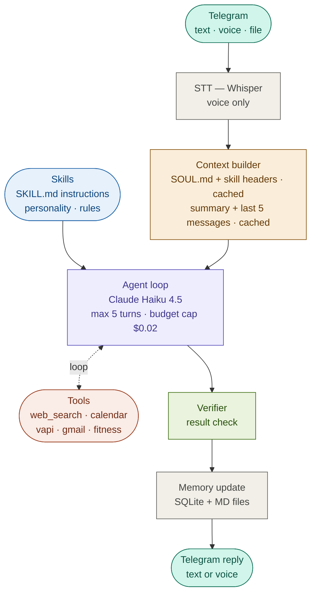

# MILO

**My Intelligent Life Operator** — a personal AI assistant that lives in Telegram.

Send a text or voice message. MILO figures out what to do and does it — searches the web, books appointments, manages your calendar, tracks workouts. Talks like a friend: short, honest, occasionally funny.

---

## How it works



One agent loop — no fixed routing. Claude sees the message, picks tools, executes steps, and replies when done.

**Example — pharmacy hours:**
```
You:   "дізнайся до котрої працює аптека на Хрещатику"
Turn 1: web_search("аптека Хрещатик години роботи")
Turn 2: results received → form reply
MILO:  "Аптека на Хрещатику 22 працює до 22:00."
```

**Example — book a haircut:**
```
You:   "знайди перукарню і запишись на п'ятницю"
Turn 1: web_search("перукарня поруч")
Turn 2: make_phone_call(number, "записатись на п'ятницю")
Turn 3: create_calendar_event("Перукарня", "Friday 11:00")
MILO:  "Done. Style at 11 on Friday. Added to calendar."
```

---

## What it does

| | |
|---|---|
| 💬 | Answers questions and has conversations |
| 🔍 | Searches the web for current info |
| 🎙️ | Understands voice messages |
| 🧠 | Remembers conversation history |

---

## Stack

| Component | Technology |
|---|---|
| Runtime | Node.js + tsx |
| Telegram | grammY |
| LLM | Claude Haiku 4.5 |
| STT | gpt-4o-mini-transcribe |
| Storage | better-sqlite3 + Markdown files |
| Package manager | pnpm |

---

## Skills

Skills are plain Markdown files that tell MILO how to behave in specific domains. Edit a file — the next message picks up the change. No redeploy needed.

```
skills/
├── fitness/SKILL.md      ← how to log workouts, track PRs
├── calendar/SKILL.md     ← rules for scheduling
└── phone/SKILL.md        ← how to handle calls
```

---

## Docs

- [Structure](docs/structure.md) — file structure and data flow
- [Architecture](docs/architecture.md) — how the system works
- [Tools](docs/tools.md) — available tools and how to add new ones
- [Skills](docs/skills.md) — how to write and use skills
- [Memory](docs/memory.md) — conversation history and personal data
- [Setup](docs/setup.md) — installation and configuration
- [Cost](docs/cost.md) — pricing and optimization

---

## Setup

```bash
git clone https://github.com/yourusername/milo.git
cd milo
cp .env.example .env          # fill in API keys
cp user/SOUL.example.md user/SOUL.md  # customize personality
pnpm install
pnpm dev
```

---

## Status

- [x] Telegram bot (text + voice)
- [x] Claude Haiku 4.5 with prompt caching
- [x] SQLite message history (better-sqlite3, WAL mode)
- [x] Voice transcription (gpt-4o-mini-transcribe)
- [x] Web search (Anthropic built-in tool)
- [x] SOUL.md — external personality config
- [ ] Skills system (auto-discovery from skills/)
- [ ] Google Calendar integration
- [ ] Phone calls via Vapi
- [ ] Fitness tracking tools
- [ ] Conversation summary and long-term memory
- [ ] Verifier (result validation)
- [ ] Docker deploy

---

MIT License
