# 🚀 MILO: My Intelligent Life Operator

**MILO** is a personal AI assistant that lives in **Telegram** and your **Terminal (via Claude Code)**. It understands voice, searches the web in real-time, and tracks your fitness through hot-swappable Markdown skills.

---

## 🧠 Architectural Philosophy

Unlike heavy agentic frameworks, MILO is built for speed, cost-efficiency, and absolute control:

* **Single Agent Loop:** No fixed or hardcoded routing. Claude evaluates the context, selects the necessary tools, and executes steps autonomously.
* **Prompt Caching:** System prompt (SOUL.md, skill headers) is marked for caching to reduce repeated token costs.
* **Hybrid Memory:** Combines the speed of **SQLite** for message history with the transparency of **Markdown** files for long-term personality and user data.
* **No-Redeploy Skills:** Instructions are decoupled from the engine. Edit a Markdown file in your vault, and MILO’s behavior updates instantly across all interfaces.

---

## 🏗️ How it works

```mermaid
flowchart TD
    A([Telegram / CLI\ntext · voice]) --> B[STT — gpt-4o-mini-transcribe\nvoice only]
    B --> C[Context builder\nSOUL.md + skill headers\nconversation history]

    E([Skills\nSKILL.md instructions\npersonality · rules]) --> D
    C --> D[Agent loop\nClaude Haiku 4.5\nmax 10 turns]
    D <-.loop.-> F([Tools\nweb_search · read_data · write_data])

    D --> H[Save + Reply\nSQLite + MD files]
    H --> I([Telegram reply\ntext or voice])

    style A fill:#d1f5ea,stroke:#0f6e56,color:#085041
    style I fill:#d1f5ea,stroke:#0f6e56,color:#085041
    style D fill:#eeedfe,stroke:#534ab7,color:#3c3489
    style C fill:#faeeda,stroke:#854f0b,color:#633806
    style E fill:#e6f1fb,stroke:#185fa5,color:#0c447c
    style F fill:#faece7,stroke:#993c1d,color:#712b13
    style B fill:#f1efe8,stroke:#5f5e5a,color:#444441
    style H fill:#f1efe8,stroke:#5f5e5a,color:#444441
```



One agent loop — no fixed routing. Claude sees the message, picks tools, executes steps, and replies when done.

**Example — pharmacy hours:**
```
You:   "дізнайся до котрої працює аптека на Хрещатику"
Turn 1: web_search("аптека Хрещатик години роботи")
Turn 2: results received → form reply
MILO:  "Аптека на Хрещатику 22 працює до 22:00."
```

**Example — exchange rate:**
```
You:   "який курс долару?"
Turn 1: web_search("курс USD UAH сьогодні")
Turn 2: results received → form reply
MILO:  "Курс USD/UAH зараз 43,56 грн за долар."
```

---

## 📁 Project Structure

```
milo/
├── src/             # TypeScript engine (rebuilt on deploy)
│   ├── bot/         # Telegram transport, middleware, access control
│   └── tools/       # Tool registry (web_search, read_data, write_data)
├── .claude/         # Shared instructions for MILO & Claude Code CLI
│   └── skills/      # Markdown skills (hot-swappable logic)
├── user/            # Personal data (volume mount, git-ignored)
│   ├── SOUL.md      # MILO's personality and core rules
│   └── memory/      # Long-term facts, goals, and learned preferences
├── docs/            # Architecture, tools, skills, memory, setup, cost
├── db/              # Persistent SQLite database
└── logs/            # JSONL daily log files
```

---

## Docs

- [Architecture](docs/architecture.md) — how the system works
- [Structure](docs/structure.md) — file structure and data flow
- [Tools](docs/tools.md) — available tools and how to add new ones
- [Skills](docs/skills.md) — how to write and use skills
- [Memory](docs/memory.md) — conversation history and personal data
- [Setup](docs/setup.md) — installation and configuration
- [Cost](docs/cost.md) — pricing and optimization

---

## Setup

```bash
git clone https://github.com/Liakhov/milo.git
cd milo
cp .env.example .env          # fill in API keys
cp user/SOUL.example.md user/SOUL.md  # customize personality
pnpm install
pnpm dev
```

---

## Status

- [x] Telegram bot (text + voice)
- [x] Claude Haiku 4.5
- [x] SQLite message history (better-sqlite3, WAL mode)
- [x] Voice transcription (gpt-4o-mini-transcribe)
- [x] Web search (Anthropic server tool)
- [x] SOUL.md — external personality config
- [x] Skills system (detection + activation from .claude/skills/)
- [x] Structured logging (JSONL daily files + colored console)
- [x] Chat allowlist (ALLOWED_USER_IDS)
- [x] Dockerfile (multi-stage build)
- [x] Fitness tracking (read_data/write_data + fitness skills)
- [x] Two modes: Telegram bot + Claude Code CLI with shared data
- [ ] Prompt caching optimization
- [ ] Conversation summary and long-term memory

---

MIT License
