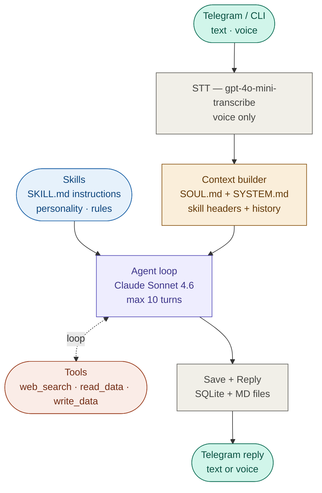

# 🚀 MILO: My Intelligent Life Operator

**MILO** is a personal AI assistant that lives in **Telegram** and your **Terminal (via Claude Code)**. It understands voice, searches the web in real-time, and tracks your fitness through hot-swappable Markdown skills.

---

## 🧠 Architectural Philosophy

Unlike heavy agentic frameworks, MILO is built for speed, cost-efficiency, and absolute control:

* **Single Agent Loop:** No fixed or hardcoded routing. Claude evaluates the context, selects the necessary tools, and executes steps autonomously.
* **Prompt Caching:** System prompt (SOUL.md, SYSTEM.md, skill headers) is marked for caching to reduce repeated token costs.
* **Hybrid Memory:** Combines the speed of **SQLite** for message history with the transparency of **Markdown** files for long-term personality and user data.
* **No-Redeploy Skills:** Instructions are decoupled from the engine. Edit a Markdown file in your vault, and MILO’s behavior updates instantly across all interfaces.

---

## 🏗️ How it works



One agent loop — no fixed routing. Claude sees the message, picks tools, executes steps, and replies when done.

**Example — web search:**
```
You:   "what are the best running shoes under $150 right now?"
Turn 1: web_search("best running shoes 2026 under $150")
Turn 2: results received → form reply
MILO:  "Top 3 in that range: Nike Pegasus 42, Asics Gel-Nimbus 27, Hoka Clifton 10.
        Pegasus is the all-rounder, Nimbus is softer for long runs, Clifton is the lightest."
```

**Example — workout logging (fitness-writer skill):**
```
You:   "log workout: squat 100×5×3, bench press 70×8×3, pull-ups 12×3"
Turn 1: read_data("fitness/profile.md") → load user profile
Turn 2: write_data("fitness/workouts.md") → append session
MILO:  "Logged. Squat 100 kg — new PR, last time was 95×5."
```

**Example — progress check (fitness-reader skill):**
```
You:   "how's my progress over the last month?"
Turn 1: read_data("fitness/workouts.md") → load history
Turn 2: read_data("fitness/weight.md") → load weight log
MILO:  "Past month: squat +10 kg, bench +5 kg, deadlift stalled.
        Weight steady at 82–83 kg. Deadlift plateaued — consider switching accessories."
```

---

## 📁 Project Structure

```
milo/
├── src/             # TypeScript engine (rebuilt on deploy)
│   ├── bot/         # Telegram transport, middleware, access control
│   └── tools/       # Tool registry (web_search, read_data, write_data)
├── .claude/         # Shared instructions for MILO & Claude Code CLI
│   └── skills/      # Markdown skills (hot-swappable logic)
├── user/            # Personal data (volume mount)
│   ├── SOUL.md      # MILO's personality and style
│   ├── SYSTEM.md    # Operational rules, data paths, context
│   └── memory/      # Long-term facts, goals, and learned preferences (git-ignored)
├── docs/            # Architecture, tools, skills, memory, setup, cost
├── db/              # Persistent SQLite database
└── logs/            # JSONL daily log files
```

---

## Docs

- [Architecture](docs/architecture.md) — how the system works
- [Structure](docs/structure.md) — file structure and data flow
- [Tools](docs/tools.md) — available tools and how to add new ones
- [Skills](docs/skills.md) — how to write and use skills
- [Memory](docs/memory.md) — conversation history and personal data
- [Setup](docs/setup.md) — installation and configuration
- [Cost](docs/cost.md) — pricing and optimization

---

## Setup

```bash
git clone https://github.com/Liakhov/milo.git
cd milo
cp .env.example .env          # fill in API keys
# edit user/SOUL.md and user/SYSTEM.md to customize
pnpm install
pnpm dev
```

---

## Status

- [x] Telegram bot (text + voice)
- [x] Claude Sonnet 4.6
- [x] SQLite message history (better-sqlite3, WAL mode)
- [x] Voice transcription (gpt-4o-mini-transcribe)
- [x] Web search (Anthropic server tool)
- [x] SOUL.md + SYSTEM.md — external personality and rules config
- [x] Skills system (detection + activation from .claude/skills/)
- [x] Structured logging (JSONL daily files + colored console)
- [x] Chat allowlist (ALLOWED_USER_IDS)
- [x] Dockerfile (multi-stage build)
- [x] Fitness tracking (read_data/write_data + fitness skills)
- [x] Two modes: Telegram bot + Claude Code CLI with shared data
- [ ] Prompt caching optimization
- [ ] Conversation summary and long-term memory

---

MIT License
